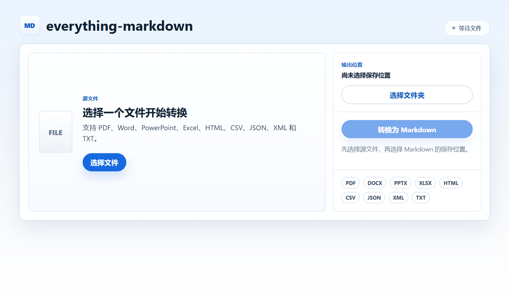

# Everything Markdown

Everything Markdown 是一个 Windows 桌面工具，用来把本地文件转换成 Markdown。应用基于 Electron 构建，转换能力由 Microsoft MarkItDown 提供。



## 功能

- 支持将常见办公文档和文本类文件转换为 `.md` 文件。
- 可以选择源文件和 Markdown 输出目录。
- 支持拖拽文件到窗口中快速选择源文件。
- 输出文件不会覆盖已有文件，会自动追加编号，例如 `report (1).md`。
- 发布版已经内置 Python 转换器，普通用户不需要单独安装 Python 或 Node.js。

## 支持格式

当前支持：

```text
PDF, DOCX, PPTX, XLSX, HTML, HTM, CSV, JSON, XML, TXT
```

## 普通用户教程

### 1. 下载并运行

在 GitHub Releases 中下载 Windows 便携版：

```text
Everything Markdown 0.1.0.exe
```

下载后双击运行即可。便携版不需要安装，建议把它放在一个固定目录中，方便以后继续使用。

### 2. 选择需要转换的文件

打开软件后，可以用两种方式选择源文件：

- 点击「选择文件」，从文件选择窗口中选择一个文件。
- 直接把文件拖到软件窗口左侧的文件区域。

如果文件格式受支持，界面会显示可以转换；如果格式暂不支持，需要换成 `PDF`、`DOCX`、`PPTX`、`XLSX`、`HTML`、`CSV`、`JSON`、`XML` 或 `TXT` 文件。

### 3. 选择 Markdown 保存位置

点击「选择文件夹」，选择生成的 `.md` 文件要保存到哪个目录。

软件会记住上一次选择的输出目录，下次打开时会自动带出来。

### 4. 开始转换

源文件和输出目录都选好后，点击「转换为 Markdown」。

转换完成后，界面会显示生成的 Markdown 文件路径。点击「打开文件所在位置」可以直接在资源管理器中定位生成的文件。

### 5. 文件命名规则

默认输出文件名会沿用源文件名：

```text
report.pdf -> report.md
```

如果输出目录里已经存在同名文件，软件不会覆盖旧文件，而是自动追加编号：

```text
report.md
report (1).md
report (2).md
```

## 开发环境教程

### 1. 准备环境

需要安装：

- Node.js 20+
- Python 3.11+

### 2. 安装依赖

在项目根目录执行：

```powershell
npm install
python -m pip install -r requirements.txt
```

### 3. 本地运行

```powershell
npm start
```

开发模式下不会使用打包后的内置转换器，而是调用 `scripts/convert.py`。因此本地运行前必须先安装 `requirements.txt` 中的 Python 依赖。

### 4. 运行测试

```powershell
npm test
```

当前测试覆盖了文件格式识别、输出路径生成和目录可写性检查等核心转换辅助逻辑。

## 打包 Windows 便携版

执行：

```powershell
npm run dist:win
```

该命令会先用 PyInstaller 构建内置转换器，再用 electron-builder 生成 Windows 便携版。

构建完成后，产物会生成到 `release/` 目录：

```text
release/Everything Markdown 0.1.0.exe
```

## 常见问题

### 转换失败怎么办？

先确认源文件存在、没有被其他程序独占，并且输出目录可写。如果是开发模式，还需要确认已经执行：

```powershell
python -m pip install -r requirements.txt
```

### 为什么生成的 Markdown 内容不完整？

转换结果取决于 MarkItDown 对源文件的解析能力。复杂排版、扫描版 PDF、图片中的文字、特殊表格或嵌入对象可能无法完整还原。

### 会不会覆盖原来的 Markdown 文件？

不会。目标文件已存在时，软件会自动生成带编号的新文件。
